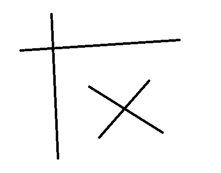
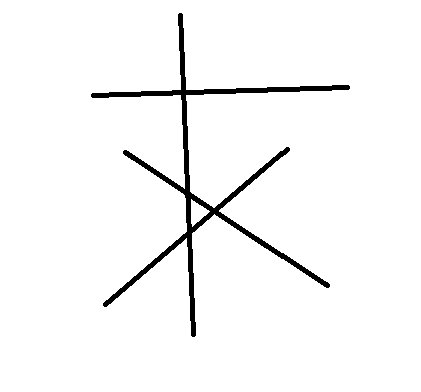
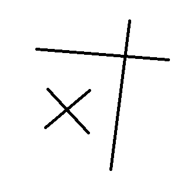
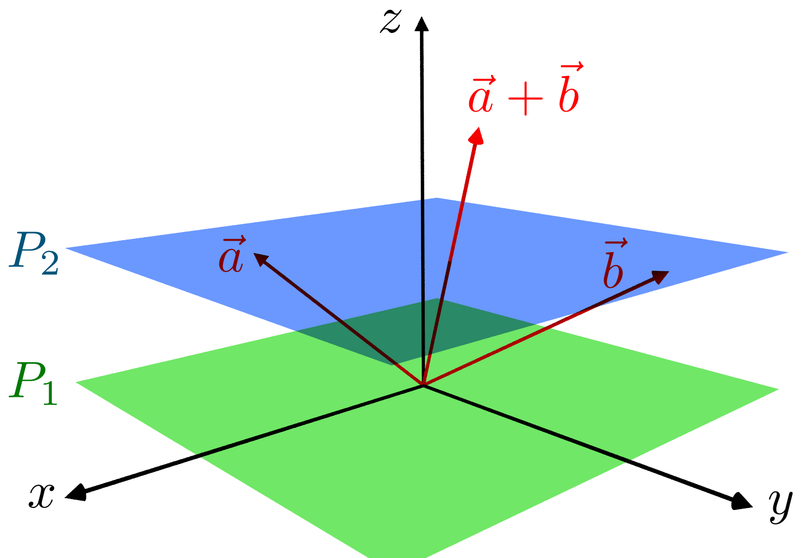

# Lecture 4: Sept 17
## Dot Product Cont'd...
### Standard basis vectors

e1 = [1, 0, 0]\
e2 = [0, 1, 0]\
e3 = [0, 0, 1]

a\*e1 + b\*e2 + c\*e3 

e1, e2, e3 are also sometimes represented by i, j, k

## Cross Product
- Just for 3D vectors

u =\
[u1,\
u2,\
u3]

v =\
[v1,\
v2,\
v3]

u x v =\

| i | j | k |
|---|---|---|
| u1 | u2 | u3 |
| v1 | v2 | v3 |

  

= i\*(u2\*v3 - u3\*v2)\
\- j*\(u1\*v3 - u3\*v1)\
\+ k\*(u1\*v2 - u2\*v1)

This gives a vector that is perpendicular to both u and v, and has magnitude equal to the area of the parallelogram formed by u and v.

### Area of Triangle
- Area of triangle with vertices A, B, C is\
|AB x AC|/2

#### Example
u = [0, 3, 0]
v = [2, 0, 0]

u x v = i\*(3\*0 - 0\*0) - j\*(0\*0 - 0\*2) + k\*(0\*0 - 3\*2)\
= -6k

Area = |u x v|/2 = 6/2 = 3

## Points
- geometric objects are based on points
- location in plane or space
- Point-vector addition
- Point-point subtraction
- Point-point addition!??

### Valid Operations on Points
- Point - Point = Vector
    - Q - P = V
    - Vector from P to Q
    - Example:
        - P = [1, 2, 3]
        - Q = [4, 5, 6]
        - V = Q - P = [4-1, 5-2, 6-3] = [3, 3, 3]
    
- Point + Vector = Point:
    - Q = P + V
    - Translation of of P by V
    - Example:
        - P = [1, 2, 3]
        - V = [2, 3, 4]
        - Q = P + V = [1+2, 2+3, 3+4] = [3, 5, 7]

### Point Addition
- Example:
    - P = [1, 0]
    - Q = [0, 1]
    - R = P + Q = [0+1, 1+0] = [1, 1]

    - V = [5, 0]
    - P' = P + V = [1+5, 0+0] = [6, 0]
    - Q' = Q + V = [0+5, 1+0] = [5, 1] So
    - R' = R + V = [1+5, 1+0] = [6, 1]
    - The triangle formed by P, Q, R is not similar to the triangle formed by P', Q', R'
    - Not a valid operation

- Example 2:
    - R = P/2 + Q/2
    - R = (P - P/2) + Q/2
    - R = P + (Q - P)/2
    - It is valid, because it becomes a point + vector operation

#### In General:
- R = a\*P + b\*Q
- a + b = 1

### 3 Points
- P, Q, R Triangle
- G = (P + Q + R)/3
- G is the centroid of the triangle
- G = P - P/3 - P/3 + Q/3 + R/3
- G = P + (Q - P)/3 + (R - P)/3
- G = Point + Vector + Vector

#### In General:
- G = a1\*P + a2\*Q + a3\*R
- a1 + a2 + a3 = 1
- a1, a2, a3 are barycentric coordinates of Triangle PQR
- Important in computer graphics

- Example:
    - P = [1, 0, 0]
    - Q = [0, 1, 0]
    - R = [0, 0, 1]
    - G = [1/3, 1/3, 1/3]
        - G is the centroid of the triangle formed by P, Q, R
    - D = [1/2, 1/2, 0]
        - D is the midpoint of PQ
    
    - How about this?
        - F = 1.2\*P - 0.2\*Q + 0\*R
        - F is outside the triangle

### To Wrap Up
P1, P2, ..., Pn\
Sum of ai\*Pi is Geometric
if and only if\
Sum of ai = 1

if sum of ai = 0, then it is a vector

otherwise, it is undefined

## Affine Space
- Collection of points and an associated vector space

